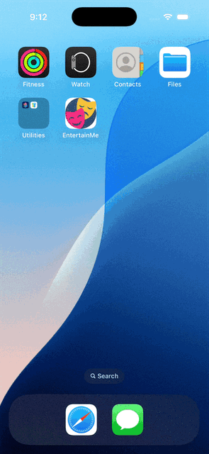

# EntertainMe!

EntertainMe! is a lightweight entertainment app currently supporting:
- Dad Jokes
- Random Facts
- Trivia Questions

## Tech Stack

Built for iOS 18+, EntertainMe leverages this core tech stack:
- Swift & SwiftUI
- MVVM Architecture
- Protocol-oriented approach for optimization
- Async/Await Concurrency

## Recordings

### Splash Screen

### Happy Path App Demo

### Sad Path App Demo (Simulated Network Failures)

